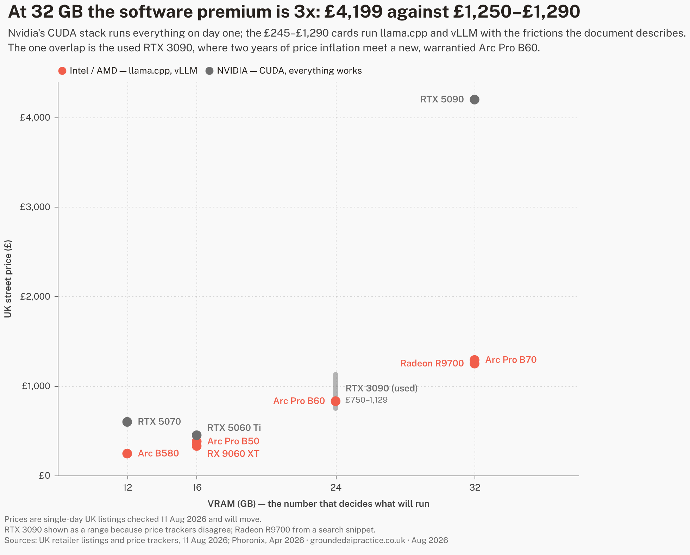
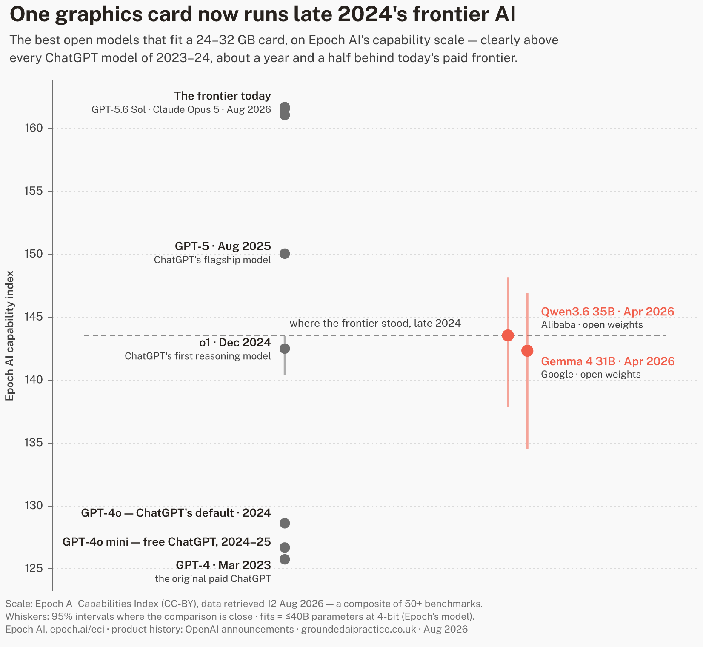

# Budget VRAM for local AI: the Intel question

> **NOTE** Draft status: rough draft, research passes of 2026-08-11
> and 2026-08-12 (`research_log.md` Entries 068–073, 078–079).
> Structure and evidence are in place; final prose is the creator's,
> per the project's outward-facing-documents rule. Every price in this
> document is a UK listing price retrieved on 2026-08-11 unless stated
> otherwise, and prices are currently moving fast — see "The market
> this lands in".

Running a language model on your own machine instead of through a paid
API is the most direct route to three things: work that never leaves
the building, a cost that stops scaling with usage, and an
understanding of what these systems actually are. Whether it is worth
doing depends mostly on one number on the hardware side. This document
is about that number, and about the unusual position Intel has taken on
it.

## Why VRAM is the number that matters

A language model has to sit in memory to run at speed. Its size in
memory is set by its parameter count and its precision: a
30-billion-parameter model at full precision wants roughly 60 GB, but
the standard practice for local use is *quantisation* — storing the
weights at reduced precision, which cuts memory to roughly 4–5 bits per
parameter with a modest quality cost. Quantised, that same 30B model
fits in about 18–20 GB.

The memory it has to fit into is the graphics card's own memory — VRAM.
When a model does not fit, it either fails to load or spills into
ordinary system RAM, which typically costs an order of magnitude in
speed. So at purchase time, VRAM capacity decides *which class of model
you can run at all*; every other specification only decides how fast.

What the tiers buy, at mid-2026 model sizes:

| VRAM | What fits (quantised) | Measured example |
|---|---|---|
| 12 GB | 7–9B dense models; small mixture-of-experts models | — |
| 16 GB | 12–14B dense; 20B-class mixture-of-experts | — |
| 24 GB | 27–32B dense at 4-bit | Gemma 4 31B at 18.6 tok/s on one card `[BENTECH-ARC26]` |
| 32 GB | 27–32B at higher precision or longer context | Qwen3 Coder 30B served at scale `[SR-B70-26]` |
| 48 GB+ (multi-card) | 70B-class dense; 120B-class mixture-of-experts | GPT-OSS 120B on a 4×32GB rig `[SR-B70-26]` |

Two calibration points for the speeds quoted through this document:
people read at roughly 5 tokens per second, so anything above ~10 tok/s
is comfortable for interactive use; and batch throughput (hundreds or
thousands of tokens per second across many simultaneous requests) is a
different measurement that only matters when a machine serves many
users or a queue of jobs.

> **TIP** The per-card number matters as much as the total.
> Mixture-of-experts models split across cards well; large dense models
> prefer one big pool of memory. Two 24 GB cards are not always worth
> one 48 GB card, and the software for splitting is where the friction
> lives.

## The market this lands in

GPU prices normally drift downward over a product's life. In 2026 they
are doing the opposite. Memory manufacturers have pivoted fab capacity
toward the high-bandwidth memory that AI data centres buy, and the
knock-on to the ordinary graphics memory in consumer cards has been
severe: GDDR6 spot prices roughly tripled between late 2025 and
mid-2026, DRAM contract prices rose about 90%, Nvidia has raised
GeForce prices three times this year and AMD once, and industry
reporting expects the shortage to run into 2028 (`[MEMCRISIS26]`,
search-level synthesis).

Two practical consequences. Any price in any document — including this
one — is a snapshot, and needs its date attached. And the usual advice
to wait for prices to settle currently has no evidence behind it; the
published forecasts point the other way.

## What Intel is selling

Intel's discrete GPU line began as a gaming product. What it has become
is more specific: a workstation line whose selling point is VRAM
capacity per pound, aimed squarely at local AI inference.

| Card | VRAM | Board power | US list | UK street (2026-08-11) |
|---|---|---|---|---|
| Arc B580 (consumer) | 12 GB | ~190 W | $249 | £200–290, promotions below £200 |
| Arc Pro B50 | 16 GB | 70 W | $349 | from ~£380 (one listing £310) |
| Arc Pro B60 | 24 GB | 120–200 W | ~$500–599 | ~£830 |
| Arc Pro B60 Dual (partner boards) | 48 GB | ~400 W | ~$1,200 class | £1,699.99, pre-order (2–4 weeks) |
| Arc Pro B70 | 32 GB | 160–290 W | $949 | ~£1,290 |

(`[GPU-PRICES-UK26]`, `[SR-B70-26]`; the B70 launched 2026-03-25 and
its US street price exceeded $1,100 within months, which the reviewers
attribute to the memory market.)

The strategic signal matters as much as the cards. In April 2026 the
technology press reported — from leaks, not from Intel — that the next
generation of consumer gaming cards is cancelled, with the architecture
redirected to data-centre and workstation parts
(`[ARC-ROADMAP-PRESS26]`). What Intel has confirmed is "Crescent
Island": a data-centre GPU that does inference only, carries 160 GB of
deliberately cheap memory (LPDDR5X rather than high-bandwidth memory),
runs air-cooled, and is pitched by Intel on "performance per dollar"
and token economics, sampling late 2026 (`[INTEL-CRESCENT26]`).

Read together: capacity-per-pound over raw bandwidth is not a niche Arc
happens to occupy. It is the bet Intel's GPU division is now built
around — at the same time as its consumer gaming line appears to be
winding down.

## What it measures like

The independent measurements are thinner than for Nvidia hardware —
five primary sources this pass, three of them run on vendor-supplied
hardware — but they are consistent, and they are not small numbers.

At serving scale: a July 2026 professional review put four B70s
(128 GB of VRAM, about $3,800 of GPU at list) in one server and
measured Mistral Small 24B at 8,321 tokens per second at batch 32 —
which it reports as roughly 65% ahead of an RTX Pro 6000, a single
Nvidia card costing about double the four Intel cards together. The
same rig reached ~12,000 tok/s on Llama 3.1 8B and 6,870 tok/s on
GPT-OSS 120B, and against a consumer RTX 5070 showed up to 85% higher
throughput and 6.2x faster time-to-first-token under load
(`[SR-B70-26]`). A second serving test confirms the shape on the
cheaper card: four B60s running a 30B-class mixture-of-experts model
measured ~1,000 tokens per second aggregate, scaling near-linearly
from 16 to 64 simultaneous requests — on stock vLLM built from
source as well as Intel's own container, which matters below
(`[EMBEDDEDLLM-B60-26]`).

On one card: a practitioner benchmark measured Gemma 4 31B (4-bit) at
18.6 tok/s and Qwen3.5-27B at 10.1 tok/s on a single B70
(`[BENTECH-ARC26]`) — three to four times reading speed for models in
the class that handles serious drafting, summarisation and extraction
work. The 35B-class mixture-of-experts models run quicker still:
37.2 tok/s on a single B60 (`[L1T-B60-26]`, read directly this pass,
replacing an earlier search-level figure that had mixed up the two
cards) and 54.7 tok/s on a single B70, from a repository that also
logged measured load power of 37–186 W depending on the model
(`[PMZFX-B70-26]`).

## The comparison, honestly

What the realistic options cost per gigabyte, at the dated prices —
the span now runs about £20 to £131:

| Option | VRAM | Launch | UK price (2026-08-11) | £/GB | Software path |
|---|---|---|---|---|---|
| Arc B580, new | 12 GB | £250 | ~£245 | ~£20 | llama.cpp (Vulkan/SYCL) |
| RTX 5070, new | 12 GB | £539 | ~£599 | ~£50 | Everything (CUDA) |
| RX 9060 XT 16GB, new | 16 GB | £315 | ~£330 | ~£21 | llama.cpp (Vulkan/ROCm) |
| Arc Pro B50, new | 16 GB | £310* | ~£380 | ~£24 | llama.cpp (Vulkan/SYCL) |
| RTX 5060 Ti 16GB, new | 16 GB | £399 | ~£450 | ~£28 | Everything (CUDA) |
| Arc Pro B60, new | 24 GB | £532* | ~£830 | ~£35 | llama.cpp; vLLM containers |
| RTX 3090, used | 24 GB | — | £750–1,129 (trackers conflict) | £31–47 | Everything (CUDA), no warranty |
| Radeon AI PRO R9700, new | 32 GB | £1,153* | ~£1,250 | ~£39 | llama.cpp; vLLM (ROCm) |
| Arc Pro B70, new | 32 GB | £842* | ~£1,290 | ~£40 | llama.cpp; vLLM containers |
| RTX 5090, new | 32 GB | £1,919 | ~£4,199 | ~£131 | Everything (CUDA) |
| Arc Pro B60 Dual, pre-order | 48 GB | — | ~£1,700 | ~£35 | llama.cpp; vLLM containers |

Launch is the vendor's UK MSRP where one was published. The workstation
cards have no UK RRP, so `*` marks a US list converted at $1 = £0.7396
(2026-08-12) with 20% VAT added — a comparison aid, not a price anyone
was ever quoted. Intel published no MSRP for the B60 at all; $599 was
the launch retail entry. The used RTX 3090 is a 2020 card and has no
comparable launch price. Sources and limits: `research_log.md`
Entry 078.

Reading the table rather than just ranking it:

- Per gigabyte, the small cards win — but capability moves in steps,
  not gradients. 12 GB and 24 GB are different classes of machine, and
  the premium above ~£25/GB is buying *one contiguous pool*, which is
  what large dense models want.

- The B60's UK position is weaker than its design. At the US street
  price (~$599–658) it works out near £23/GB landed; at the current UK
  £830 it loses most of its price advantage over the used 24 GB
  Nvidia route. The card's case in the UK rises and falls with that
  premium.

- The used RTX 3090 — the standard budget answer to "24 GB" since
  2023 — has roughly doubled in listed price in a year, to somewhere
  between £750 and £1,129 depending on the tracker (both listing-based;
  neither publishes sold prices). A new, warrantied B60 at £830 now
  overlaps it. That overlap did not exist when this project first
  logged the local-AI cost question (Entry 030).

- Nvidia's premium is not for the silicon; it is for CUDA — every
  tool, every new model, every tutorial works there first, usually
  on day one. But it is not one number: roughly £100 at 16 GB, 2.4x
  at 12 GB, and 3.3x at 32 GB, where the only new CUDA card carrying
  that much memory is a £4,199 gaming flagship that launched at
  £1,919. Whether the premium is worth paying depends on who is
  operating the machine — and on which tier they are buying at.

- The open stack is not only Intel's. AMD's Radeon AI PRO R9700 puts
  32 GB at ~£1,250 — marginally under the B70 — and the one
  cross-vendor review to measure both judged the AMD card the better
  value at US prices, noting Intel's vLLM upstream support still
  trails AMD's ROCm (`[PHORONIX-ARCPRO26]`). At this tier the
  realistic comparison is two open-stack cards against one £4,199
  CUDA card, not Intel against the field.

- The 48 GB single-slot answer exists but is not yet ordinary
  retail: the dual-GPU B60 board lists at £1,699.99 in the UK on
  pre-order — the same ~£35/GB as the single B60, for double the
  pool. The used CUDA route to 48 GB, the RTX A6000, tracks at
  ~$3,650 in the US used market and was the one falling price found
  in this entire pass (`[GPU-PRICES-UK26]`).

- **Measured against their own launch prices, these cards have moved
  very differently, and the two readings point opposite ways.** Every
  option here now sells above its launch price except the B580. Intel's
  workstation cards carry the steepest UK premium of any new card in the
  table — the B60 at roughly 1.6x its converted list, the B70 1.5x —
  and that premium is precisely what erases the B60's advantage at
  24 GB. Yet at 32 GB the gap between Intel and Nvidia is *wider* at
  today's street prices, 3.3x, than it was at launch, 2.3x, because the
  RTX 5090 has moved furthest of anything here: £1,919 at its UK launch
  to £4,199 now. So the UK market penalises the Intel case in the middle
  of the table and flatters it at the top (`research_log.md` Entry 078).

- Apple's unified-memory machines are the other genuine route to large
  local models and are deliberately out of scope of a GPU table; they
  price a whole computer, not a component. Worth a separate pass if the
  buyer does not already own the PC.

## Where the software actually is

This is the section that decides whether the hardware prices above are
real for a given buyer.

The polished experience is CUDA-only. On Arc, what exists in mid-2026:

- **llama.cpp works on Arc today** through two back-ends: Vulkan
  (universal, slower) and SYCL (Intel-optimised, roughly 2x faster on
  dense models when it works). "When it works" is doing real work in
  that sentence: the practitioner benchmark found a SYCL bug on one new
  model architecture where the second response answered the first
  question, and dropped to Vulkan for it (`[BENTECH-ARC26]`). The
  pace cuts both ways: one forum rig measured a 45% generation gain
  on the same card between the March and April SYCL builds
  (`[L1T-B60-26]`), while the April cross-vendor review still found
  GPT-OSS 20B underperforming on Intel under llama.cpp
  (`[PHORONIX-ARCPRO26]`).

- **Intel archived its consumer path in January 2026.** IPEX-LLM — the
  official route to Ollama and llama.cpp on Arc, the one most setup
  guides still lead with — is now read-only, with Intel stating it
  "will not provide or guarantee development of or support for this
  project" (`[IPEXLLM-GH26]`). Ollama itself has no native Arc support
  as of July 2026.

- **The supported path is enterprise-shaped.** Intel's active
  investment is LLM Scaler: a containerised vLLM distribution for
  Linux, aimed at multi-GPU workstations. It produced the serving
  numbers above and is updated regularly — and the same review that
  measured those numbers calls it "still a beta release at best", with
  limited model coverage (`[SR-B70-26]`). A measured alternative now
  exists: stock upstream vLLM, built from source, ran the same
  4×B60 rig — Intel's container ~20–25% faster per output token,
  stock vLLM roughly half the time-to-first-token
  (`[EMBEDDEDLLM-B60-26]`) — though Intel's upstream position in
  vLLM still trails AMD's and Nvidia's (`[PHORONIX-ARCPRO26]`), and
  the upstream-support story is itself Intel-authored: the vLLM
  project's Arc post is written by the "Intel vLLM Team"
  (`[VLLM-ARC25]`). What operating the stack looks like in practice,
  from the one practitioner write-up to document the whole path: a
  kernel floor of 6.12+, a manual firmware step where the shipped
  and wanted GuC versions disagree, ~54 GiB of system RAM consumed
  by one quantisation conversion, and a backend split the operator
  must know (Vulkan for hybrid models, SYCL for dense) — summarised
  by its author as "maturing fast but not mature"
  (`[BENTECH-ARC26]`).

> **WARNING** The pattern across those three facts: Intel is supporting
> the deployment where a technical operator runs containers on Linux,
> and has withdrawn from the deployment where an individual installs an
> app. A buyer without that operator — and in a small organisation
> that is usually everyone — is depending on community software, on
> hardware whose vendor just demonstrated it will cut consumer tooling.

For day-one support of newly released models, quantisation tooling and
fine-tuning, CUDA remains months ahead as a matter of routine; nothing
found this pass suggests otherwise.

## The break-even against just paying for the API

Cheap VRAM only matters if running locally beats renting intelligence
by the token. The current API floor, from the vendor's own price list
(`[ANTHROPIC-PRICING26]`, 2026-08-11): the cheapest current Claude
model costs $1 per million input tokens and $5 per million output
tokens — half that in batch — and Anthropic's own worked example prices
10,000 support conversations at roughly **$37**.

Set the £830 B60 against that example: about **two years** of a
10,000-conversation-per-month workload, before counting electricity,
the machine around the card, or anyone's time. This project logged the
same shape of conclusion from weaker sources in July (Entries 030,
042): below a high usage threshold, the API route stays cheaper, and
hybrid — local where volume, privacy or control demand it, API where
capability does — is the practical answer.

What moves the arithmetic toward the box:

- **Volume an order of magnitude higher** — continuous
  classification/extraction pipelines, always-on agents, anything that
  runs all day rather than on demand.

- **Work that cannot leave the building** — where the comparison is not
  against $37 but against not doing the work at all, or doing it by
  hand.

- **Predictability** — a fixed cost an SME can capitalise, against a
  metered cost that scales with success.

- **Learning value** — the project's Priority 6 question. A local
  machine teaches what a metered API hides; that value is real but
  belongs in a different column from cost.

> **CHECK** The capability gap still applies — and the four-month
> headline is not the buyer's number. The widely quoted finding that
> open models lag the frontier by about four months (Entry 042) is
> earned by trillion-parameter releases that need a server rack;
> mixture-of-experts economics thin out the compute per token, not the
> memory. On one capability scale (Entry 079, Epoch AI): the best
> models that actually fit a 24–32 GB card — Qwen3.6 35B-A3B, Gemma 4
> 31B — sit where the paid frontier stood in late 2024. That is
> clearly above every ChatGPT model of 2023–24, level with the first
> reasoning models, and about a year and a half behind today's
> frontier, with the gap widest on exactly the complex multi-step work
> that has improved most since. A workload still has to be
> *adequately* served by that late-2024-class capability for any of
> the above to matter — and that adequacy is task-specific and
> untested here.

## The roadmap risk

A buyer in August 2026 is making a three-part bet: that the card keeps
being driven (Arc Pro is current and extending — B70 arrived in March),
that the software keeps improving (active, but "beta at best", and the
consumer tier was just cut), and that the platform exists in three
years (Intel's GPU division is now explicitly an inference-economics
business with $18bn of fresh backing, including Nvidia's — and its
consumer future is reported, not confirmed, to be ending;
re-checked 2026-08-11, still no Intel statement either way). None of
those three legs is settled the way CUDA is settled. The discount is
not free money; it is payment for carrying that uncertainty.

## What this document does not count

Stating the uncounted, per the project's bias checklist:

- **People's time.** Setup, maintenance and debugging on the
  less-trodden path — usually the largest real cost for a small
  organisation, and the one this document can least generalise.

- **Electricity at idle.** Load power is now measured at three
  points — 59 W average on a B50 across mixed workstation loads
  (`[PHORONIX-ARCPRO26]`), 153 W on a B60 and 231 W on a B70 under
  vLLM generation (`[BENTECH-ARC26]`), with 37–186 W by model under
  llama.cpp (`[PMZFX-B70-26]`) — but no idle figure was found
  anywhere, and the current Linux driver does not expose GPU power
  in software, so settling idle takes a wall meter on real hardware
  (flagged in Open Threads).

- **Model churn.** Local model files need replacing as the state of
  the art moves; the API route absorbs that invisibly.

- **Sold prices.** Every used-market figure here is a listing price;
  the two trackers conflict by ~£380 and neither publishes completed
  sales.

- **Benchmark breadth.** Seven primary sources now, every surfaced
  lead read — but three ran on vendor-supplied hardware, one is
  vendor-authored (the vLLM post), one declares a PCIe bottleneck,
  and two are individual rigs with published but unverified
  methodology. Independent replication on a rig nobody supplied
  remains the hands-on unit's job.

- **Resale and warranty claims practice** for a workstation line this
  young.

## What would settle it

Desk research ends where this question actually gets decided. The step
that would convert this document from assessment to evidence is small
and concrete:

- One card — the £1,290 Arc Pro B70, decided 2026-08-13 for the 32 GB
  tier the argument rests on (`project_log.md` Entry 081).

- The two software paths as an ordinary technical user would find
  them: llama.cpp with Vulkan and SYCL, then the containerised vLLM
  route.

- A fixed task set shaped like SME work: batch classification,
  document extraction, long-document summarisation, retrieval-answering
  over a real folder.

- Three numbers per task — tokens per second, watts at the wall,
  minutes of human intervention — and a written record of everything
  that failed on the way.

Published with the failures left in, that is a document nobody else in
the UK appears to be producing, and it is the project's method applied
to its own subject matter.

## Sources

Research basis: `research_log.md` Entries 068–073, 2026-08-11, and
the source key rows they added — primary reads `[SR-B70-26]`,
`[BENTECH-ARC26]`, `[IPEXLLM-GH26]`, `[ANTHROPIC-PRICING26]`,
`[EMBEDDEDLLM-B60-26]`, `[PHORONIX-ARCPRO26]`, `[L1T-B60-26]`,
`[PMZFX-B70-26]`, `[VLLM-ARC25]`; price snapshots
`[GPU-PRICES-UK26]`; synthesis-level `[MEMCRISIS26]`,
`[ARC-ROADMAP-PRESS26]`, `[ARC-STACK-GUIDES26]`; Intel-confirmed
strategy `[INTEL-CRESCENT26]`. Every surfaced lead in this thread
has been read. Entries 078–079, 2026-08-12, added the launch-price
layer (`[GPU-LAUNCH-PRICES26]`) and the capability comparison —
primary reads `[EPOCH-ECIDATA26]`, `[EPOCH-GPUGAP25]`,
`[OPENAI-4OMINI24]`; cross-checks `[AA-INDEX26]`,
`[LLMEXPLORER26]`. Earlier evidence relied on: Entries 030 and 042
(local-vs-cloud break-even and capability gap).
