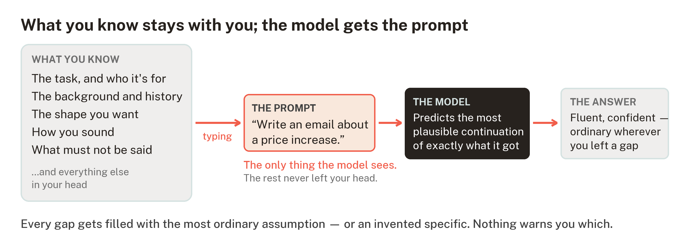

# Effective prompting — what's really happening when you hit send

> **NOTE** Draft status: first full draft, 2026-08-11, untested with
> learners. Structure, evidence and exercises are in place; final prose
> is the creator's, per the project's outward-facing-documents rule.
> Design basis and sources are at the end of the unit. Time to
> complete: roughly 45–60 minutes, in one sitting or two.

You type a question into an AI assistant. Something comes back —
fluent, confident, and somehow not quite what you wanted. Most people
conclude the tool is overrated, or that there is a knack they were
never taught. There is a knack, and it is learnable in an hour,
because it is not really about the tool. It is about noticing how
much of what you know never made it into the box.

**What you need:** any AI assistant you already use or can open free
of charge — ChatGPT, Claude, Copilot and Gemini all work identically
for everything here. Nothing to install, nothing to sign up for
beyond the assistant itself, and no previous experience assumed. If
you have already been using one of these tools informally, this unit
will not ask you to unlearn anything — it explains why the prompts
that worked for you worked.

## What you'll be able to do

By the end of this unit you should be able to do four things, and
each one is checkable against your own real work:

- Write a prompt for a real task that gets a usable first draft, not
  a generic one.

- Read an AI answer and diagnose, from the answer alone, what was
  missing from the prompt that produced it.

- Decide what background a task needs before you start typing, using
  a five-part checklist that fits on a sticky note.

- Recognise the situations where no prompt will fix it — where the
  problem is the task, not the wording.

## What happens when you hit send

An AI assistant does not look your question up. It *generates* an
answer: given everything in the conversation so far, it predicts, one
small piece at a time, the words most likely to come next — drawn
from the patterns in the enormous amount of text it was trained on.
That single fact explains most of what you will see it do, good and
bad.

Three consequences are worth holding onto:

- **It only has what is in the conversation.** Your words, plus
  anything you have attached. It cannot see your screen, your files,
  your customers or the meeting you have just left. Whether it
  remembers your *previous* conversations depends on the tool and its
  settings — some assistants now carry memory between chats — so
  check yours rather than assume.

- **It fills every gap with the most ordinary assumption.** Asked for
  "an email to customers about a price increase" with nothing else,
  it produces the email an average business would send to average
  customers about an average increase — because, statistically, that
  is the most plausible answer to what you actually typed. Vague
  prompts do not get *wrong* answers. They get *average* ones.

- **Confidence is part of the style, not evidence of checking.** The
  answer arrives fluent and certain because fluent, certain text is
  what it learned to produce — not because anything was verified on
  the way. A made-up figure and a true one read identically.

The whole skill of prompting is visible in one picture — the gap
between the first box and the second:



> **TIP** A useful mental picture, borrowed from how AI vendors
> describe their own systems: treat the assistant as a brilliant new
> employee on their first morning. Enormously capable, completely
> ignorant of your organisation, and unable to ask what you meant
> unless you invite questions. Nobody hands a new starter a task in
> eight words and expects the right result.

## A worked example

Here is a task shaped like real work. A small firm is putting its
prices up 8% from January, the first increase in three years, and
needs to tell existing customers.

**The prompt most people write:**

> Write an email to customers about a price increase.

What comes back is grammatical, polite, and useless — the same email
every business on earth would send. Typical openings include lines of
the shape *"We are writing to inform you of an upcoming adjustment to
our pricing structure"*, followed by unexplained talk of "rising
costs" and "continued commitment to quality". Run it yourself in a
moment and compare; the wording will differ, the averageness will
not. Nothing in it is wrong. Nothing in it is yours.

Now the same task with the gap closed. The five numbered comments are
the five moves this unit teaches:

> Write an email to our existing customers announcing a price
> increase. **[1 — the task, and who it's for]** We're a
> five-person IT support firm; our customers are small local
> businesses, most of them with us for years, and the tone we use
> with them is plain and personal, never corporate.
>
> Background you should use: prices rise 8% on 1 January — our first
> increase in three years. The reason is that our own software
> licensing and insurance costs have risen about 20% over those three
> years, and we've absorbed that until now. Existing contracts are
> unaffected until renewal. **[2 — the background it can't know]**
>
> Keep it under 200 words, no subject-line options, just the email.
> **[3 — the shape: length and format]** The register we want
> sounds like this: "We'd rather tell you straight than bury it in
> jargon." **[4 — an example of the voice]** Don't apologise for
> the increase, don't use the phrase "valued customer", and don't
> promise anything about future prices. **[5 — what to leave out]**

Same tool, same task, and the second prompt produces a first draft
you could edit into use in a few minutes — because this time the
model was continuing *your* situation, not the average of everyone
else's.

### The five moves, named

1. **Say the task and who it's for.** Not just what to produce —
   what it is *for*, and who will read it. Audience changes
   everything about how text should be written, and the model cannot
   infer an audience you never mentioned.

2. **Give the background it cannot know.** The facts of your
   situation: numbers, dates, history, names, the content of the
   thing you are responding to. Paste it in. This is the move that
   feels most unnecessary and matters most — every fact you leave
   out is a gap the model will fill with something ordinary or, worse,
   something invented.

3. **Set the shape.** Length, format, structure, tone. "Under 200
   words, as a table, in plain English" is a sentence, and it saves
   three rounds of "shorter, please".

4. **Show what good looks like.** One example of the voice, format
   or standard you want — a past email, a paragraph you like, a
   house-style line. An example steers tone and format more reliably
   than any amount of description.

5. **Say what to leave out.** Exclusions, red lines, things it must
   not claim or promise. The model cannot respect a constraint it
   was never given.

Not every prompt needs all five — a quick factual question needs
none of them. The judgement you are building is knowing *which* gaps
matter for this task. When the output will represent you — an email,
a document, anything a customer or colleague reads — they usually
all do.

### Reading the answer like a marker

The second half of the skill is diagnosis. A weak answer is not a
verdict on the tool; it is information about your prompt, and it
tells you exactly which move is missing:

| What you see in the answer | What it means | The fix |
|---|---|---|
| Generic filler; could be any business | It doesn't know who you are or who's reading | Move 1 |
| Invented specifics — figures, names, reasons you never gave | A gap where background should be; it filled the gap | Move 2, then check every specific |
| Wrong length, wrong format, bullet points you didn't want | The shape was never stated | Move 3 |
| Right facts, wrong voice — stiff, gushing, "corporate" | It has no sample of how you sound | Move 4 |
| Includes things you'd never say — apologies, promises, padding | No red lines were drawn | Move 5 |

> **WARNING** Invented specifics deserve their own warning, because
> they are the one failure a better prompt reduces but never removes.
> The industry calls them *hallucinations*: confident, fluent,
> plausible statements that are simply not true. They survive good
> prompting because generating plausible text is what the system
> *is*, not a bug being fixed. The working rule: any specific you
> did not supply — a number, a name, a date, a price, a legal or
> technical claim — is unverified until you have checked it
> somewhere that does not run on autocomplete. Checking AI output
> properly is its own skill, and the planned second unit in this
> series.

## Guided practice

Three exercises, about fifteen minutes together. The first two need
no AI tool at all — the skill being practised is reading and
diagnosis, and answers follow each exercise.

### Exercise 1 — diagnose before you fix

Two prompts as people actually type them. For each, name the moves
that are missing (there may be several), and predict what the answer
will get wrong before you ever run it.

**Prompt A:**

> summarise this report

*(pasted beneath it: a 30-page PDF)*

**Prompt B:**

> Write a job advert for an administrator. Make it good.

**Discussion — Exercise 1.** Prompt A is missing move 1 above all:
summarised *for whom, to do what?* A summary for the board, a summary
for a new starter and a summary deciding whether to read the full
report are three different documents; unstated, you get a generic
abstract of the whole thing, evenly weighted and useless for any
specific purpose. Shape (move 3) is absent too — one page? five
bullets? Prompt B supplies no organisation, no duties, no location or
salary or hours (move 2) — so every one of those will arrive
*invented*, and a job advert full of invented specifics is worse than
no draft at all. "Make it good" does nothing: the model was already
producing the most plausible advert it could. Quality instructions
work when they are concrete — *what* good means here (move 4), and
what to exclude (move 5).

### Exercise 2 — rewrite one

Take Prompt B and rewrite it using the five moves, for an
organisation you know — real or invented, but specific. Then check
your rewrite against the list: task and audience stated; the actual
duties, hours, pay and place supplied; length and format set; a line
showing the voice; the exclusions drawn (for a job advert, the things
you must not say are partly a legal matter — which is itself worth
noticing: the model will not reliably know your jurisdiction's rules
unless told, and even told, you check).

There is no single right answer, which is the point: your rewrite
should be unmistakably *yours* in a way Prompt B never was.

### Exercise 3 — run the comparison

Now open your assistant and run the worked example's two prompts —
the eight-word version, then the full version (adapt the details
freely; invented ones are fine for practice). Put the two answers
side by side and mark, in the second one: which sentence exists
because of move 2, which shape exists because of move 3, which
phrases carry the voice from move 4. Then find one specific in
*either* answer that you never supplied — and notice how confidently
it is stated.

## Independent practice — your task, this week

Pick one real writing task from your own week — an email you owe
someone, a notice, a summary, a description. Before typing anything,
fill in the five lines below (this is the sticky-note version of the
unit):

```text
Task + reader:
Background it can't know:
Shape (length/format/tone):
Example of what good looks like:
Leave out / never claim:
```

Turn the five lines into a prompt, run it, and then do one diagnosis
pass on the answer using the table above — one round of "the tone's
still wrong → add a better example", not ten rounds of "no, try
again". If the second answer is usable, stop. Two things to notice
while you work:

- How much of the improvement came from *you deciding things* —
  audience, shape, red lines — before the tool was involved at all.
  A prompt is mostly a decision record.

- Whether any specific in the final draft is unchecked. If it will
  be sent to a real person, check it first.

> **CHECK** A quick self-test for any prompt, adapted from the test
> one vendor's own documentation recommends: show it to a colleague
> with no context and ask them to do the task. Whatever they would
> have to ask you — that is exactly what the model needed and did
> not have. If no colleague is handy, the assistant itself can play
> the part: end your prompt with "before answering, ask me anything
> you need to know", and see what comes back.

## When prompting is not the fix

Part of the skill is recognising the tasks where no wording will
save you. Four honest cases:

- **The task needs facts the model cannot have.** Today's prices,
  your unpublished figures, what your customer said on the phone. No
  prompt conjures these; either supply them or do not use the tool
  for this.

- **The task is a judgement only you can make.** Whether to put
  prices up at all is not a prompting problem. The tool drafts the
  announcement; it does not own the decision, and prompting cannot
  transfer the responsibility.

- **The stakes make "probably right" not good enough.** Legal
  wording, medical questions, regulated advice, anything
  contractual: drafts may still help, but a qualified human owns
  every word before it is used, and for some of these the honest
  answer is not to start from a generated draft at all.

- **You cannot tell whether the answer is right.** If a task is so
  far outside your knowledge that you could not spot a wrong answer,
  a fluent one is a risk, not a saving. Use the tool to *learn the
  ground* first — definitions, the questions to ask — not to act.

## One week later

Come back to this in about a week — spacing the practice out is one
of the better-evidenced ways to make it stick. Take a new task, and
write the five lines from memory before looking at anything in this
unit. If they come without looking, the unit has done its job. If
one keeps not coming, that line is your personal gap — most people
lose move 4 first, and it is the one that most changes the voice of
what comes back.

## Where this unit comes from

This unit is the pilot of a larger project, and its design decisions
are recorded and sourced in that project's public repository:

- **Why prompting first:** chosen from four evidenced candidate
  capabilities (`research_log.md` Entries 039–040; decision record
  `project_log.md` Entry 013). The unit deliberately folds in a
  working model of *what the system does with your input*, because
  the sequencing evidence says instruction-writing taught without
  that model becomes a checklist rather than judgement.

- **Why this shape:** sized and structured to published criteria for
  workplace AI training — one 30–90 minute stackable unit, practical
  before theoretical, building on informal use rather than assuming
  none, explicit about when *not* to use AI (`research_log.md`
  Entry 026) — and sequenced worked example → guided practice →
  independent practice → spaced return, following the Gradual
  Release of Responsibility model (`research_log.md` Entry 027).

- **Technique verification:** the five moves check out against AI
  vendors' own current prompting guidance, read 2026-08-11
  (`research_log.md` Entry 072) — stated tool-neutrally here,
  because the moves transfer across every current assistant.

- **What this unit does not claim:** it has not yet been tested with
  learners — that trial is the project's next step for it, and until
  then it is a designed artefact, not an evidenced one. Checking AI
  output against reality is deliberately a separate (second) unit;
  this one teaches you to get a better draft, not to trust one.
