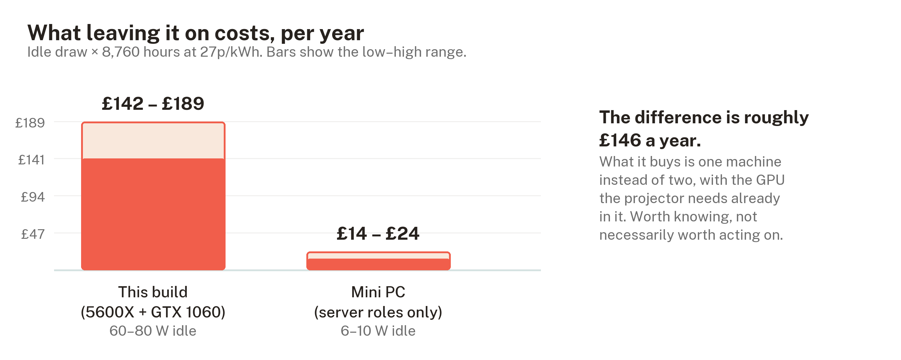
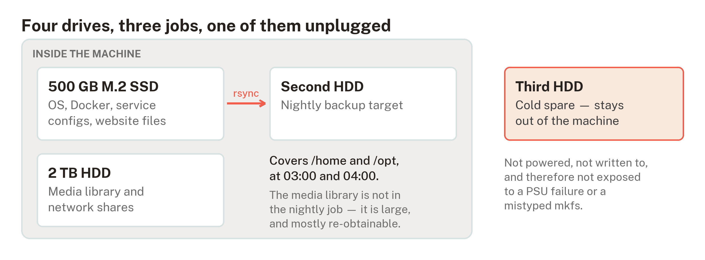
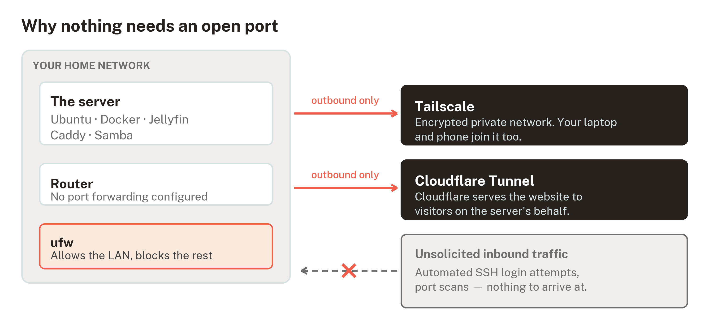
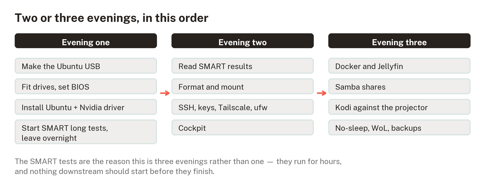

# Building a home server: decisions and reasoning

## What this is

A short account of building an always-on Linux server from an existing
desktop PC — what it does, what was decided, and why each decision went
the way it did.

It is published for two reasons. The build is the first practical
infrastructure this project owns, and it is a worked example of the
project's own method: decisions made explicitly rather than drifting into
place, claims checked before they are written down, and the reasoning kept
next to the conclusion so a reader can disagree with it.

The full step-by-step procedure is kept privately, because it carries a
specific machine on a specific home network. This document is the part
that generalises.

> **NOTE** — This is a record of work in progress, not a finished case study. Where something is untested, it says so.

---

## The machine and what it does

Existing hardware, repurposed rather than bought: a six-core Ryzen 5
5600X, 32 GB of memory, a mid-range GPU, a 500 GB SSD and two second-hand
hard drives, in a mini-ITX case. It runs five roles at once — always-on
server, remote-access workstation, media centre driving a projector, small
network-attached storage, and a small website host.

Repurposing rather than buying is itself the first decision. A dedicated
mini PC would use roughly a tenth of the electricity, and for the server
roles alone it would be the better answer.

The difference is real money — around £146 a year. What it buys is one
machine instead of two, with the graphics card the projector needs already
in it. Worth knowing before committing, which is why it is stated up front
rather than discovered later.

---

## Four decisions worth explaining

### No RAID

RAID keeps data across several disks so the array survives one failing. It
is the obvious answer for a machine with multiple drives, and it was
rejected for four independent reasons.

Mismatched capacities waste space, because RAID sizes itself to the
smallest member. Motherboard RAID is firmware rather than a real
controller, so a dead board makes the array awkward to read anywhere else.
Drives bought at the same time fail at around the same time, and rebuilding
an array stresses every surviving disk at exactly the wrong moment.

The fourth reason is the one that matters most. **RAID is not backup.** It
survives a disk dying. It does nothing about deleting the wrong folder,
ransomware, a failing power supply taking everything with it, or the
building flooding. Treating one as the other is a common and expensive
mistake.

What replaced it is deliberately simple: each drive has one job, one drive
holds a nightly copy of the things that cannot be re-downloaded, and one
stays out of the machine entirely as a cold spare. A drive that is not
powered cannot be destroyed by the power supply that kills the others.

The media library is **not** in the nightly copy. That is a choice rather
than an oversight — a library is large and mostly re-obtainable — but it
means one drive has no second copy anywhere, and saying so plainly is the
point.

### Ubuntu Desktop rather than a server distribution

Counter-intuitive for a server, and the reasoning is about the operator
rather than the software. The machine drives a projector, so it needs a
graphical desktop regardless; adding one to a server installation
afterwards is an unpleasant first Linux task. The proprietary graphics
driver is a checkbox during installation rather than manual work with
kernel modules. Long-term support gives five years of security updates
with no forced upgrades.

The decisive factor is documentation. Pasting an error message into a
search engine returns working answers for Ubuntu LTS more reliably than
for any alternative, and for someone learning, that outweighs the
technical merits of a leaner system. Proxmox, TrueNAS, Debian and Arch
were each considered and rejected on that basis.

The cost is about 300 MB of memory out of 32 GB. It is not a real
trade-off at this scale.

### Nothing is exposed to the internet

The conventional way to reach a home server from outside is to forward a
port on the router. Exposed SSH attracts thousands of automated login
attempts a day, every one of them free to keep trying.

Both remote-access routes here are **outbound connections instead**. A
mesh VPN joins the server to a private network shared with a laptop and
phone; a tunnel service publishes the website by connecting out to the
provider, which then serves visitors on the server's behalf. Neither
requires an open port, and both sidestep the changing home IP address
entirely.

This is the single highest-value decision in the build. It removes an
entire category of attack — the kind that begins with someone scanning
your address — rather than defending against it.

### The media source is not the media *player* for everything

The server feeds an AV receiver over HDMI, which drives the speakers and
passes video through to the projector. That works for a personal library.
It does not work for UK live sport, and finding that out early saved an
evening.

Neither major UK sports streaming service supports Linux, and it is an
operating-system check rather than a browser one. Beyond either service's
policy, content protection on Linux is software-only, which caps most
premium services below high definition and rules out 4K entirely.

No configuration of the machine and no choice of provider changes that.
The answer is a separate streaming device on the receiver's second input —
which is what the extra inputs are for. Recognising when a problem should
not be solved in software is part of the same discipline as solving one.

---

## Two things that are easy to get wrong

Both are included because they are silent failures: the system reports
success while not doing what you believe.

**A container firewall gap.** Docker publishes container ports by writing
rules into a different part of the packet-filtering chain than the
standard Ubuntu firewall manages. The consequence is that a published
container port is reachable across the network while the firewall
continues to report it as closed. There is no warning. The fix used here
is to bind containers to the local machine only and reach them over the
private network, and to verify what is genuinely listening rather than
trusting the firewall's own summary.

**Automatic updates cover less than people assume.** Ubuntu's unattended
upgrades ship configured for the official security pocket only. Software
installed from its own repository — which, on this machine, includes the
VPN, the container runtime and the web server — is never updated
automatically. Believing you are patched when you are not is worse than
knowing you are not, so the build treats a monthly manual update as part
of the routine rather than assuming automation has it covered.

---

## How the work was sequenced

Two or three evenings, paced by one long-running task: the surface tests
on the second-hand drives run for hours, and nothing that stores data
should begin before they finish. Both drives came from a drawer with
unknown history, and a drive that has begun reallocating sectors does not
recover.

The same principle applies to the old data on them. One was a Windows
system disk whose account passwords were long forgotten — which turns out
not to matter, because a Windows account password controls login, not
encryption. Absent full-disk encryption, the files are readable from
another operating system. Checking that before erasing anything cost half
an hour and is the only genuinely irreversible step in the build.

---

## What is not finished

- The drives have not yet passed their surface tests, so nothing has been
  trusted with data.

- The power supply is from a 2015 line and is the least mitigated risk in
  the build. Nothing in the plan addresses it, and saying so is more
  useful than quietly hoping.

- Backups are two copies, one medium, zero offsite. The standard
  formulation is three, two, one. The gap is known and currently accepted.

---

## Why this is in a research repository

Grounded AI Practice is about building practical capability through
responsible, hands-on learning, and about the discipline that makes
learning trustworthy — traceable claims, explicit decisions, and a clear
line between what is evidenced and what is assumed.

This build is a small test of whether that discipline survives contact
with a real task. Several claims in the original draft did not survive
checking: an early diagram showed a backup that the actual scheduled job
never performed; a widely repeated fact about which storage port a
particular component disables turned out to rest on forum posts about a
different circuit board, and was replaced with an instruction to read what
the machine itself reports; and the assumption that live sport could be
made to work with the right software was wrong in a way no amount of
configuration would fix.

Each of those was found by checking rather than by failing later. That is
the whole argument, demonstrated at small scale.

The procedure this summarises also serves as a structural prototype for
the project's planned learning units — orientation before action, one idea
per step, a stated way to confirm each step worked, and screenshots of
what the learner should actually see, generated from the same data that
produces the instructions so the two cannot drift apart.
