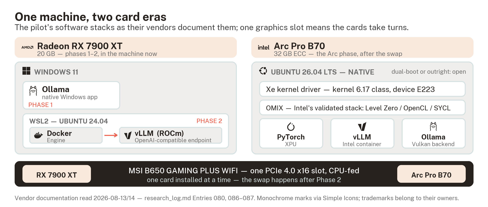
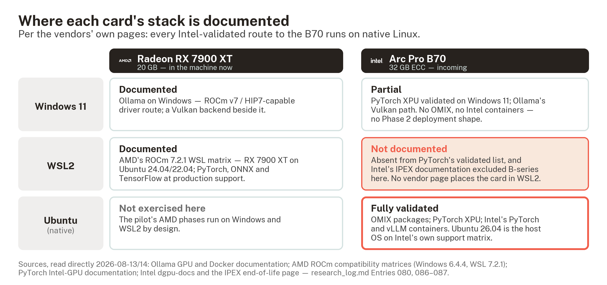

# 파일럿 AI 워크스테이션

*데스크톱에서 제품 가설을 검증하다*

> **NOTE** 문서 상태: 초안입니다. 2026-08-13에 노트북에서 작성했으며, 대상 머신에는 아직 어떤 소프트웨어도 설치하지 않았습니다. 아래의 스택 관련 사실은 모두 공급업체 공식 문서로 검증했고, 확인 날짜를 함께 표기했습니다. 각 단계는 데스크톱에서 실제로 실행하기 전까지 **계획(planned)** 으로 표시하며, 실행한 뒤에야 지침으로 승격합니다. 이는 이 프로젝트의 "검증 후 교육" 원칙에 따른 것입니다. 최종 문구는 작성자의 것입니다.
>
> 2026-08-14 데스크톱에서 직접 개정했습니다. 하드웨어 표는 이제 기억이 아니라 머신이 보고한 값을 담고 있으며, Arc 카드를 장착할 호스트도 결정되었습니다(`project_log.md` Entry 083). 소프트웨어 단계는 여전히 실행 전입니다.

> **TIP** 번역본 안내. 이 문서는 영어 원문을 한국어로 옮긴 것입니다. 제품명, 명령어, 파일 경로, 인용 키(`[SR-B70-26]` 등), 그리고 측정 프로토콜의 고정 프롬프트는 **의도적으로 영어 원문 그대로 두었습니다.** 특히 고정 프롬프트는 측정의 입력값 자체이므로, 번역하면 실행 결과를 서로 비교할 수 없게 됩니다. 그림 두 점도 영어 원본 그대로이며, 캡션만 번역했습니다.

## 이 파일럿의 목적

이 프로젝트에는 현재 검증 대상인 제품 가설이 있으며, `project_log.md` Entry 080에 기록되어 있습니다. 소규모 조직의 자체 사업장에 설치되는 AI 워크스테이션으로, 모델을 로컬에서 또는 로컬과 API를 병행하는 하이브리드 방식으로 구동하고, 해당 조직의 실제 업무에 맞춘 워크플로를 탑재하며, 올바른 사용법을 스스로 가르칠 수 있을 만큼의 안내를 내장한 장비입니다.

마지막 항목이 이 구상 전체의 핵심입니다. 이 머신은 튜터 계층을 탑재합니다. 올바른 사용법에 관한 안내를 담은 자체 프런트엔드이며, 최종적으로는 사용자가 스스로 채워 나가는 프로필을 기반으로 동작합니다. 실질적인 AI 활용 역량은 바로 여기서 길러집니다. 사용자는 워크스테이션에 로그인해 질문하는 것만으로 학습하게 됩니다. 이를 통해 사용자는 자립할 수 있고, 자신의 이해와 워크플로를 스스로 개선하고 다듬어 나갈 수 있습니다. 현재까지 조사한 범위에서는 이 요소를 하드웨어와 함께 묶어 제공하는 사례를 찾지 못했습니다. 소규모로 맞춤 배치된 AI 워크스테이션 한 대가, 현재 중견·대기업과 클라우드 컴퓨팅 중심으로 이루어지는 교육에 대한 현실적인 풀뿌리 대안이 될 수 있습니다.

이 구상을 누군가에게 제시하기 전에, 먼저 실제로 동작해야 합니다. 프로젝트가 이미 보유한 데스크톱 PC가 테스트베드이며, 파일럿은 다음 세 가지 질문에 순서대로 답합니다.

1. 프로젝트가 이미 보유한 하드웨어가 쓸 만한 모델을 쓸 만한 속도로 구동하는가? (1단계)

2. 배포 형태가 성립하는가? 즉 동일한 기능을, 직접 설치한 애플리케이션이 아니라 고객사 머신에 그대로 올릴 수 있는 Linux 컨테이너 형태로 구현할 수 있는가? (2단계)

3. 그 성능이 소규모 조직이 실제로 맡길 업무에 **충분한가**? (3단계)

1~3단계가 의도적으로 답하지 않는 것은 **Intel 관련 질문**입니다. 현재 이 데스크톱에는 AMD 카드가 장착되어 있으므로, 위 단계들은 개방형 스택 가운데 AMD 쪽(ROCm과 Vulkan)만 검증합니다. Arc Pro 제품군 고유의 소프트웨어 상황(SYCL, OMIX, 보관 처리된 IPEX-LLM, LLM Scaler)은 Arc 카드에서만 검증할 수 있습니다. 해당 카드는 이미 구매를 결정했으며(`project_log.md` Entry 081), 바로 이 머신에 장착합니다(Entry 083). AMD 단계를 먼저 배치한 이유가 여기에 있습니다. 두 카드가 사용 가능한 슬롯 하나를 공유하기 때문입니다. 문서 끝의 "Arc 카드를 어디에 장착하는가"를 참고하십시오.



## 머신 사양

| 항목 | 사양 | 파일럿에서의 의미 |
|---|---|---|
| CPU | Ryzen 7 7800X3D (8코어) | GPU 한 장을 공급하기에 충분하고도 남습니다. AM5 플랫폼이므로 Resizable BAR를 사용할 수 있으며, 이는 Arc 카드가 실제로 요구하는 플랫폼 조건입니다. |
| RAM | 32 GB | 모델 구동에는 충분합니다. 다만 모델 변환에는 부족합니다. 기록된 사례에서 양자화 변환 한 번에 시스템 RAM 약 54 GiB가 소모되었습니다(`[BENTECH-ARC26]`, VRAM 문서 경유). 로컬에서 변환하는 대신 이미 양자화된 파일을 내려받으십시오. |
| 메인보드 | MSI B650 GAMING PLUS WIFI (MS-7E26) | **그래픽 카드를 쓸 수 있는 슬롯이 하나뿐입니다.** PCI_E1은 CPU 직결 PCIe 4.0 x16이고, PCI_E2는 칩셋 경유 Gen3 x1이라 사실상 그래픽 슬롯으로 볼 수 없습니다. 따라서 두 GPU는 동시에 장착하는 것이 아니라 번갈아 사용합니다. 슬롯 구성은 공개된 제원 기준이며 아직 직접 확인하지 않았습니다. MSI 사이트가 자동 조회를 차단하고 있습니다. |
| GPU | Radeon RX 7900 XT, VRAM 20 GB | 나머지 모든 것을 결정하는 수치입니다. 아래 설명을 참고하십시오. Gen4 x16으로 연결됨을 확인했으며, 이는 이 카드 자체의 상한입니다. |
| 파워 서플라이 | Corsair RM1000x (2021), 1000 W, 80+ Gold, 풀 모듈러 | 2026-08-14에 제품에서 직접 확인했습니다. 두 카드 어느 쪽에도 여유가 충분하며, 슬롯이 하나뿐인 보드 특성상 약 315 W의 Radeon과 TBP 230 W의 B70이 동시에 전력을 끌어가는 일은 발생하지 않습니다. 초안에 있던 카드 교체 시 전력 위험 항목은 해소되었습니다. |
| 냉각 | 고효율 공랭 | 텍스트 생성은 순간적인 부하가 아니라 지속 부하입니다. 발열은 가정하지 않고 측정 중에 기록합니다. |

20 GB는 VRAM 문서가 가격과 성능을 비교한 두 등급 사이에 위치합니다. 그 문서의 용량 표를 기준으로 보면, 16 GB 등급(12~14B 밀집 모델, 20B급 mixture-of-experts)은 여유 있게 들어갑니다. 24 GB 등급(4비트 양자화 27~32B 밀집 모델)은 다소 무리일 수 있으며, 그중 큰 모델은 긴 컨텍스트를 담을 VRAM 여유를 남기지 못합니다. 이 카드에 무리 없는 목표 등급은 대략 20~30B mixture-of-experts, 그리고 4비트 기준 약 24B 이하의 밀집 모델이며, 컨텍스트용으로 2~3 GB를 남겨 두는 것을 전제로 합니다.

> **TIP** 모델 이름은 빠르게 바뀌므로, 이 문서는 개별 모델명이 아니라 모델의 등급을 지정하고 실제 설치 시점에 최신 릴리스를 선택하도록 했습니다. 프로젝트가 공개 자료를 통해 이미 벤치마크를 확인한 모델은 다음과 같습니다. Mistral Small 24B, 그리고 30~35B-A3B 계열의 mixture-of-experts 모델군입니다. 24B 밀집 모델을 선택하면 부수적인 이점이 있습니다. `[SR-B70-26]` 리뷰가 Arc 하드웨어에서 측정한 바로 그 모델이므로, 이후 Arc 카드를 도입했을 때 동일 조건 비교가 가능해집니다.

## 1단계 — 첫 토큰 생성, 네이티브 Windows

**목표:** Windows 환경에서 GPU가 약 20~30B급 최신 모델을 구동하고, 그 연산이 CPU가 아니라 실제로 GPU에서 이루어지고 있음을 확인하며, 최초 측정값을 기록하는 것입니다.

**공식 문서 기준 검증 (2026-08-13):**

- Ollama의 GPU 문서는 Radeon RX 7900 XT를 Windows 지원 목록에 포함하고 있습니다. 요구 조건은 AMD ROCm v7 / HIP7 지원 **드라이버** 스택으로 명시되어 있습니다. 이는 현재의 Adrenalin 드라이버를 의미하며, 별도의 ROCm SDK 설치를 뜻하지 않습니다.

- Ollama에는 자체 제어 옵션을 갖춘 Vulkan 백엔드도 있습니다. `OLLAMA_VULKAN=0`으로 비활성화하고 `GGML_VK_VISIBLE_DEVICES`로 장치를 선택합니다. 카드 한 장에 백엔드가 둘이라는 구조는 Arc 문서의 Vulkan/SYCL 구분과 동일한 형태이며, 결과가 이상해 보일 때 반드시 떠올려야 할 사항입니다. 어느 백엔드가 처리했는지도 결과의 일부입니다.

- AMD 자체 Windows 호환성 매트릭스(ROCm 6.4.4 페이지)는 7900 시리즈를 Windows 11에서 지원한다고 기재하면서, ROCm 스택 전체가 아직 Windows에서 지원되지는 않는다는 단서를 함께 밝히고 있습니다. 이 단서는 SDK 전체에 대한 것이며, Ollama의 드라이버 수준 경로를 막지는 않습니다.

**계획된 단계** (데스크톱에서 실행. 각 단계에는 수행 목적을 함께 적었습니다.)

1. **GPU 드라이버를 가장 먼저 업데이트합니다.** AMD Adrenalin의 최신 WHQL 릴리스를 사용합니다. Ollama가 Windows의 AMD 환경에 대해 명시한 의존 조건이며, 백엔드 관련 장애가 발생하면 드라이버 버전이 가장 먼저 의심할 대상입니다.

2. **모델을 내려받기 전에 디스크 여유 공간을 확인합니다.** 목표 등급의 양자화 파일은 개당 12~20 GB이며, 테스트를 진행하다 보면 여러 개가 쌓입니다.

3. **ollama.com에서 Windows용 Ollama를 설치합니다.** 설치 시 백그라운드 서비스, `ollama` 명령, 트레이 앱이 추가됩니다. 계정 생성은 없고, 텔레메트리 관련 선택도 설치 프로그램이 제시하는 항목이 전부입니다. 그대로 넘기지 말고 읽어 보십시오.

4. **카드 용량에 맞는 모델을 하나 받습니다.** 내려받기 전에 모델 페이지에서 파일 크기를 확인하십시오. 20 GB보다 충분히 작아야 합니다. 4비트 기준 약 24B 밀집 모델 하나와 약 30B-A3B mixture-of-experts 모델 하나를 받습니다. 두 모델의 측정이 끝나기 전에는 다른 모델을 받지 마십시오.

5. **통계 출력을 켠 상태로 처음 실행합니다:** `ollama run <model> --verbose`. 응답마다 출력되는 통계 블록이 이 단계의 핵심이므로, 대충 넘기지 말고 반드시 읽으십시오.

   - *prompt eval rate*는 모델이 입력을 읽는 속도입니다(프롬프트 기준 초당 토큰 수).

   - *eval rate*는 모델이 생성하는 속도이며, 실사용 체감을 좌우하는 수치입니다. VRAM 문서의 기준값으로 보면 사람의 읽기 속도가 초당 약 5토큰이므로, 약 10을 넘으면 머신이 독자보다 충분히 빠릅니다.

6. **GPU가 실제로 연산하고 있는지 확인합니다.** `ollama ps`는 적재된 모델이 GPU와 CPU에 각각 얼마나 올라가 있는지 보여 주며, 합격 기준은 GPU 100%입니다. 작업 관리자 → 성능 → GPU에서도 교차 확인하십시오. 모델이 적재될 때 전용 메모리가 모델 파일 크기만큼 증가해야 합니다.

7. **실패가 어떤 모습인지 미리 알아 둡니다.** eval rate가 한 자릿수이고, CPU 사용률이 높으며, VRAM이 늘지 않는다면 그것은 느린 GPU가 아니라 CPU 폴백입니다. 다음 순서로 점검하십시오. Ollama 요구 사항 대비 드라이버 버전, 모델 파일이 여유 VRAM을 초과했는지(스필 발생), 그리고 어떤 백엔드를 적재하고 어떤 장치를 인식했는지 기록된 서버 로그입니다.

> **TIP** LM Studio는 동일한 카드를 GUI로 다루는 경로이며, Windows에서 ROCm과 Vulkan 런타임을 지원합니다. 이 프로젝트에 중요한 이유도 바로 그 점입니다. CLI 경험이 없는 학습자가 부담 없이 쓸 수 있는 유형의 도구이고, 이 집단(상대적으로 기술 지식이 적은 실무자)이 바로 이 제품이 대상으로 삼는 사용자층입니다. 다만 LM Studio의 RX 7900 시리즈 지원 여부는 이 문서에서 **아직 검증하지 않았습니다.** 이 경로를 택한다면 설치 시점에 공식 문서를 확인하십시오. 어느 쪽을 쓰든 1단계 측정은 비교 가능성을 위해 Ollama로 수행합니다.

## 측정 프로토콜

VRAM 문서가 근거로 삼은 공개 수치는 모두 다른 사람의 장비에서 측정된 것이며, 다섯 개 벤치마크 출처 가운데 셋은 공급업체가 제공한 하드웨어에서 실행되었습니다. 이번이 프로젝트가 자체 하드웨어에서 얻는 최초의 측정값이므로, 기록하고 반복할 수 있는 형태로 수행할 가치가 있습니다.

**고정 프롬프트 세트.** 제품이 표방하는 업무와 같은 형태의 프롬프트 세 개이며, 모든 실행과 향후 모든 카드에서 동일하게 사용합니다. **아래 프롬프트는 측정 입력값이므로 번역하지 않고 영어 원문 그대로 사용합니다.**

1. **작성(Drafting):** *"Write a 150-word notice to customers announcing a two-day delay to all orders placed last week. Plain English, apologetic once, no excuses, no exclamation marks."*

2. **요약(Summarisation):** *"Summarise the following document in five bullet points for a manager who has not read it."* — 그리고 한 번 정해서 결과와 함께 보관하는 고정 테스트 문서를 덧붙입니다(공개된 약 2,000단어 분량의 텍스트, 단어 수를 기록). 매번 같은 문서를 사용해야 하며, 그렇지 않으면 수치를 비교할 수 없게 됩니다.

3. **추출(Extraction):** *"Turn the following into a table with columns Name, Item, Quantity, Date."* — 그리고 다음 고정 블록을 덧붙입니다.

   ```text
   jones - 3 boxes A4 paper, weds
   Mrs Patel ordered two toner carts 14/8
   K. O'Neill: 1x desk lamp + 2 x HDMI cable, monday
   accounts (S Hughes) want 5 notepads and a stapler 15 aug
   D Kowalski — six AA batteries, no date given
   ```

**실행마다 기록할 항목.** 측정을 시작하면 이 문서 옆에 결과 표를 두고 실행 한 번당 한 행씩 기록합니다.

| 항목 | 기록 이유 |
|---|---|
| 날짜, 드라이버 버전, Ollama 버전 | 결과는 소프트웨어에 따라 달라집니다. 날짜 없는 수치야말로 VRAM 문서가 경고하는 함정입니다. |
| 모델, 양자화 태그, 컨텍스트 길이 | 결과를 가장 크게 바꾸는 세 가지 설정입니다. |
| Prompt eval rate / eval rate | 두 속도를 혼동하지 않도록 분리해 기록합니다. |
| 사용 VRAM (작업 관리자) | 모델이 어디에 올라갔는지 확인하고 컨텍스트 여유를 파악합니다. |
| 비고 | 발열, 소음, 그 밖의 이상 징후. 이 단계에서는 감각적 판단으로도 충분합니다. |

프롬프트마다 세 번씩 실행하고 eval rate의 중앙값을 기록합니다. 중앙값은 간헐적인 정체 구간의 영향을 산술 평균보다 덜 받습니다.

> **WARNING** 공개된 서빙 벤치마크는 성격이 다른 측정값입니다. VRAM 문서가 인용한 `[SR-B70-26]`의 수치는 배치 크기 32의 서빙 처리량, 즉 동시 요청을 다수 처리한 결과입니다. 이 프로토콜의 단일 스트림 수치는 그보다 훨씬 낮게 나오며 서로 비교할 수 없습니다. 이 경계를 넘어 비교하는 것은 프로젝트가 `project_log.md` Entry 078에서 교육 사례로 지적한 3단계 혼동과 같은 오류입니다.

## 2단계 — 배포 형태 (WSL2, Docker, vLLM)

**목표:** 동일한 카드가 Linux 컨테이너에서 OpenAI 호환 엔드포인트를 제공하고, 두 번째 컨테이너의 웹 프런트엔드가 여기에 연결되는 구성입니다. 실제로 배치되는 워크스테이션이 취할 형태이며, 모델 런타임을 건드리지 않고 운영할 수 있습니다.

> **WARNING** 이 단계는 **AMD 카드에만 해당하는 경로입니다.** WSL2가 성립하는 이유는 AMD의 호환성 매트릭스가 7900 XT를 WSL2에서 지원하기 때문입니다. B 시리즈 Arc 카드를 WSL2에서 지원한다고 명시한 공급업체 문서는 존재하지 않습니다. PyTorch가 검증한 클라이언트 GPU 운영체제 목록은 Windows 11과 Ubuntu이며, Intel의 IPEX 문서는 B 시리즈를 WSL2 대상에서 명시적으로 제외하고 있습니다(`research_log.md` Entry 087). 따라서 이 단계의 Arc 쪽은 네이티브 Linux에서 수행합니다. 마지막 절을 참고하십시오.

**공식 문서 기준 검증 (2026-08-13):**

- AMD의 WSL 호환성 매트릭스(ROCm 7.2.1)는 Radeon RX 7900 XT를 WSL2에서 지원 대상으로 기재하고 있으며, Ubuntu 24.04 또는 22.04에서 PyTorch, ONNX, TensorFlow를 공식 프로덕션 지원 수준으로 명시합니다.

- vLLM은 7900 시리즈의 아키텍처(gfx1100)를 업스트림에서 지원하되 flash-attention 없이 추가했으므로, 이 카드 등급에서는 일부 엔진 기능이 제한됩니다. 이는 결함이 아니라 예상된 사항입니다.

- **아직 검증하지 않은 사항:** 현재의 어떤 vLLM 릴리스 또는 컨테이너가 gfx1100을 별도 작업 없이 지원하는지, 그리고 WSL2 상의 ROCm 경로가 vLLM을 구동하는지입니다. AMD의 매트릭스는 위의 세 프레임워크만 언급하고 끝납니다. 이 두 가지는 vLLM 자체 AMD 설치 문서를 근거로 확인한 뒤에야 이 단계를 지침으로 정리합니다.

**계획된 단계** (위 사유로 개요만 기술합니다.)

1. `wsl --install`로 WSL2와 기본 Ubuntu를 설치합니다. BIOS에서 가상화를 활성화해야 하며 재부팅이 한 번 필요합니다.

2. `.wslconfig`에서 WSL2의 메모리 상한을 지정합니다(32 GB 중 약 16 GB). 그렇게 하지 않으면 WSL2가 호스트 RAM의 대부분을 점유하며, 호스트도 계속 동작해야 합니다.

3. GPU 접근은 AMD의 WSL 문서를 따릅니다. *Windows* 드라이버가 GPU 경로를 WSL 내부로 전달하며, 배포판 안에는 사용자 공간 ROCm만 추가됩니다. Linux 쪽에 커널 드라이버가 설치되지 않는다는 점은 베어메탈에서 작업해 본 사람일수록 의외로 느끼는 부분입니다.

4. Docker Desktop이 아니라 배포판 내부의 Docker Engine을 사용합니다. 실제 배포 형태에 더 가깝고, Docker Desktop은 일정 규모 이상의 조직에 좌석당 라이선스가 적용되어 고객사가 별도로 확인해야 하는 반면 Engine은 그렇지 않습니다.

5. vLLM의 ROCm 경로는 자체 문서를 따릅니다. 프런트엔드를 붙이기 전에 한 줄짜리 요청으로 엔드포인트를 먼저 점검하고, 그다음 웹 UI 컨테이너(Open WebUI 계열)를 해당 엔드포인트에 연결합니다.

## 3단계 — 작업 세트와 튜터 계층 (설계만)

1~2단계가 수치를 산출하기 전까지는 구체적으로 정하지 않습니다. VRAM 문서의 마무리 구상과 제품 가설에서 도출한 대략적인 형태는 다음과 같습니다.

- **고정 작업 세트.** 전부 로컬에서 실행하며, 프로젝트가 단일 카드 모델에 대해 기록한 2024년 말 수준의 성능 상한을 기준으로 **충분성**을 평가합니다(`research_log.md` Entry 079). 성숙도가 다른 두 후보가 있습니다.

  - *후보 1, 일반적인 중소기업 업무:* 일괄 분류, 정보 추출, 조직의 문체 규칙에 맞춘 문서 작성. 위의 측정 프로토콜이 이미 그대로 적용되는 쪽입니다.

  - *후보 2, 의료 RAG 워크플로 모사:* 실무적으로 무엇을 의미하는지는 현재 미정입니다.

- **튜터 계층.** 그 목적은 위의 "이 파일럿의 목적"에 기술했습니다. 3단계에서 판단해야 할 범위는 그 전체 구상보다 좁습니다. 사용 시점에 제공되는 안내가, 이 정도 사양의 머신에서, 실제로 사용자에게 무언가를 가르치는가입니다. 그 아래의 서빙 계층이 갖춰지기 전까지는 구상 단계에 머무릅니다.

## Arc 카드를 어디에 장착하는가

1~3단계는 프로젝트가 이미 보유한 하드웨어에서 추가 비용 없이 제품의 형태를 검증하며, 개방형 스택 가운데 AMD 쪽을 확인합니다. Intel 쪽 스택(VRAM 문서의 핵심 미해결 질문)은 Intel 하드웨어가 있어야 하며, 해당 카드는 이미 결정되었습니다. **Arc Pro B70**, 32 GB이며 2026-08-11 시세 기준 약 £1,290입니다. 더 저렴한 B580과 B60 대신 이 카드를 택한 이유는, 프로젝트의 조사 결과가 수렴하는 지점이 VRAM 32 GB 등급이기 때문입니다(`project_log.md` Entry 081).

**이 카드는 바로 이 데스크톱에 장착합니다**(`project_log.md` Entry 083). 상시 가동 중인 기존 AM4 Ubuntu 서버가 아니라 위에 기술한 구성을 그대로 사용합니다. 측정 프로토콜은 수정 없이 그대로 적용되며, 애초에 그러라고 설계한 것입니다. 지금까지 문헌으로만 접했던 비교를 직접 측정한 비교로 바꾸게 됩니다. 다만 카드를 구매한 것만으로 정해지는 것은 없습니다. 수치는 여전히 만들어 내야 합니다.

### 호스트가 결정하는 것과 결정하지 않는 것

이 글을 쓰기 전에 세 가지를 확인했습니다. 각각이 비용 지출이나 계획 변경의 근거가 될 수 있었기 때문입니다(`research_log.md` Entry 087).

- **Intel 메인보드와 CPU는 필요하지 않습니다.** 카드가 실제로 요구하는 플랫폼 조건은 Resizable BAR이며, AM5 Ryzen 7000 시스템이 이를 제공합니다. Intel 자체 문서도 ReBAR 또는 Smart Access Memory가 활성화된 비(非)Intel 플랫폼을 허용하고 있습니다. 보드를 교체해서 얻는 것은 호환성이 아니라 슬롯 구성입니다.

- **두 카드는 번갈아 사용합니다.** 그래픽용 슬롯이 하나뿐이므로 B70을 장착하려면 7900 XT를 빼야 합니다. 이는 작업 내용을 바꾸는 것이 아니라 순서를 정해 줍니다. Radeon으로 1~2단계를 끝낸 뒤 교체합니다. 아울러 다른 곳에서 논의된 2카드 구성도 불가능해집니다. 이는 공급업체의 제약이 아니라 보드의 제약입니다.

- **WSL2는 이 카드에 대해 문서화된 경로가 아닙니다.** 따라서 남은 미해결 질문은 머신이 아니라 운영체제입니다.

### 세 가지 운영체제 선택지

여기서 두 가지 요구가 한 방향으로 모입니다. 위의 근거에 따라 2단계는 Arc 카드에 네이티브 Linux를 요구하고, 외부 협력자와 합의한 공통 환경도 독립적으로 Ubuntu 26.04를 전제합니다. 프로젝트 자체의 다음 단계를 충족하는 경로가, 두 환경의 비교 가능성을 유지하는 경로와 일치합니다. 이를 기준으로 본 세 가지 선택지는 다음과 같습니다.

| 선택지 | 얻는 것 | 잃는 것 |
|---|---|---|
| 네이티브 Windows 11 | 검증된 PyTorch XPU, Ollama의 Vulkan 백엔드. 1단계 수치를 얻기에는 충분합니다. | OMIX도, Intel이 검증한 컨테이너도, 2단계 배포 형태도 사용할 수 없습니다. 외부 협력자와 합의한 공통 환경에서 벗어나므로 결과를 서로 비교할 수 없게 됩니다. |
| Ubuntu 26.04 듀얼 부팅 | 전부 사용할 수 있습니다. OMIX, B70 검증 컨테이너, 전체 검증 경로, 그리고 협업과 일치하는 환경입니다. | 파일럿의 AMD 구간과 Intel 구간 사이에 재부팅이 필요합니다. |
| Ubuntu 단독 사용 | 위와 같으며 재부팅도 필요 없습니다. | 이 데스크톱이 더 이상 Windows 데스크톱이 아니게 됩니다. |



### 카드가 도착하기 전에

카드가 없어도 가능한 확인 두 가지가 남아 있습니다.

1. **MSI의 슬롯 제원을 직접 확인합니다.** 해당 사이트가 자동 조회를 차단하므로 PCI_E2와 PCI_E3은 공개 제원 기준일 뿐입니다.

2. **BIOS에서 ReBAR와 Above 4G Decoding을 확인합니다.** 가정하지 말고 활성화 상태를 직접 확인하십시오.

초안에 있던 세 번째 항목은 해소되었습니다. 파워 서플라이는 Corsair RM1000x(2021), 1000 W, 80+ Gold이며, 2026-08-14에 제품에서 직접 확인했습니다. 이 보드가 허용하는 어떤 구성에도 제약이 되지 않습니다.

이후의 초기 구동 순서는 Intel 공식 문서와 협력자의 체크포인트 문서가 서로 일치합니다. 보드와 그 전력 요구 사항을 확인하고, 운영체제와 커널 6.17급 Xe 드라이버를 확인하며, 카드가 인식되어(장치 ID E223) 드라이버에 정상 바인딩되는지 확인하고, Level Zero와 OpenCL을 통해 다시 확인한 뒤, `torch.xpu`에서 실제 텐서 연산이 수행되는지를 증명합니다. 모델을 적재하거나 어떤 수치를 신뢰하기 전에 이 순서를 먼저 밟습니다.

## 출처

2026-08-13에 직접 확인했으며 공식 문서만 사용했습니다. 이 검색어에서 상위에 노출되는 SEO 성격의 블로그 글은 단서로만 참고했을 뿐 이 문서의 어떤 주장도 그것에 근거하지 않습니다.

- Ollama GPU 문서 (docs.ollama.com/gpu) — Windows에서의 RX 7900 XT, ROCm v7/HIP7 드라이버 요구 사항, Vulkan 제어 옵션.

- AMD ROCm 호환성 매트릭스, Windows, ROCm 6.4.4 (rocm.docs.amd.com) — Windows 11에서의 7900 시리즈, 스택 전체에 대한 단서 조항.

- AMD ROCm 호환성 매트릭스, WSL, ROCm 7.2.1 (rocm.docs.amd.com) — WSL2에서의 RX 7900 XT, Ubuntu 24.04/22.04, 프레임워크 지원 범위.

- vLLM 업스트림 gfx1100 지원 (vllm-project PR #2768) — 검색 수준으로만 확인. 2단계에서 현재의 vLLM AMD 문서를 근거로 재확인 필요.

2026-08-14에 직접 확인했으며, Arc 호스트 관련 절의 근거입니다(`research_log.md` Entries 086–087). PyTorch의 Intel GPU 시작 문서(검증된 클라이언트 운영체제 목록), Intel dgpu-docs(OMIX 설치 안내와 지원 매트릭스, Xe 드라이버 표) 및 IPEX 지원 종료 페이지, Ollama의 GPU와 Docker 문서, 그리고 CIM과 PnP 장치 속성으로 직접 읽은 머신 자체입니다. 두 그림은 이 사실들을 담고 있으며, 그림에 사용된 브랜드 마크는 식별을 위한 것이지 보증을 뜻하지 않습니다.

이 문서를 실제로 실행해 얻은 결과는 `research_log.md`에 통상적인 날짜별 항목으로 기록됩니다. 이 문서는 결과가 아니라 절차입니다.
